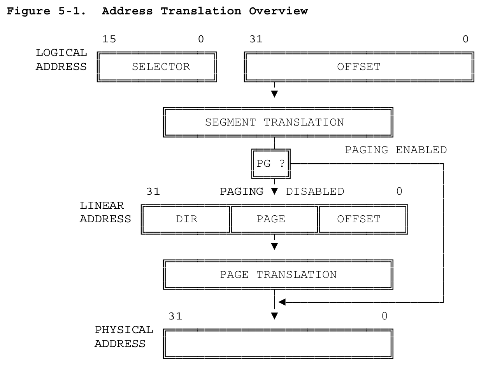

# 第 5 章 内存管理

80386 以如下两步将逻辑地址（即程序员观点的地址）转换为物理地址（物理内存的实际地址）：

* 分段地址转换，这一步将逻辑地址（由段选择器和段偏移组成）转换为线性地址。
* 分页地址转换，这一步将线性地址转化为物理地址。这一步是可选的，由系统软件设计者决定是否需要。

这些转换对应用程序员并不可见，图 5-1 高度抽象地说明了这两种转换。

图 5-1 和这章的剩余部分描述了一种简单的 80386 地址转换机制。事实上，地址转换机制也包括内存保护机制。为了简单起见，因此在第 6 章讨论了有关内存保护这一主题。

