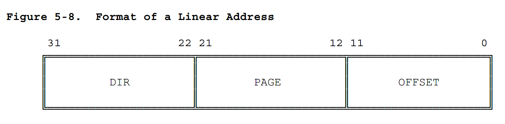
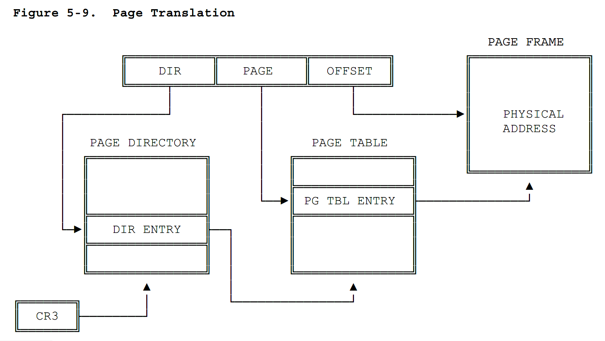
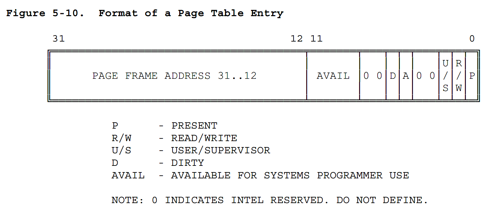
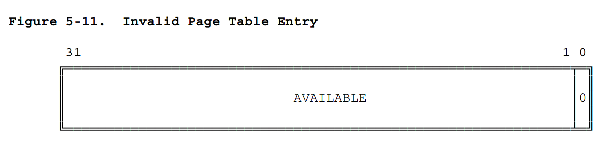

# 5.2 分页地址转换

在地址转换的第二部分，80386 处理器将线性地址转换为物理地址。这一阶段的地址转换实现了面向页面的虚拟内存系统和页级保护机制。

分页地址转换这一步骤是可选的。只有 CR0 寄存器中的 PG 位被置位时，分页地址转换才有效。此位通常在操作系统初始化软件时被置位。如果操作系统要执行多个虚拟 8086 任务、基于页级的保护或基于页的虚拟内存，则 PG 位必须被置位。

## 5.2.1 页框/页帧 (Page Frame)

一个页框是物理内存中连续地址上大小为 4K 的单元。各页从字节边界开始，大小固定不变。

## 5.2.2 线性地址

线性地址通过使用一个页表、页表中的一个页、该页中的一个偏移间接指向一个物理地址。图 5-8  展示了一个线性地址的格式。

图 5-9 展示了处理器是怎样将线性地址中的 DIR、PAGE 和 OFFSET 字段通过两级页表转换为物理地址的。寻址机制使用 DIR 字段索引页目录，使用 PAGE 字段索引确定的页目录中的页表，使用 OFFSET 字段索引由页表确定的页内的字节。





## 5.2.3 页表 (Page Tables)

页表仅仅是由 32 位页面说明符(32-bit page specifiers)组成的数组。页表本身也是一个页，因此可以包含 4K 字节内存或 1K 个 32 位表项。

在寻址一个内存页时使用了两级页表。较高的那一级页表就是页目录。页目录可寻址 1K 个二级页表。二级页表可以寻址 1K 个页。所有的页表都可以由一个页目录寻址，因此一个页目录最多可以寻址 1M 个页($$2^{20}$$)。因为每一页包含了 4K 字节($$2^{12}$$)，所以一个页目录可以寻址整个 80386 的实物理空间($$2^{20} \times 2^{12}$$ = $$2^{32}$$)。

当前页目录的物理地址被存储在 CPU 寄存器 CR3 中，该寄存器也被叫做页目录基址寄存器(PDBR, page directory base register)。内存管理软件有关于为所有任务使用一个页目录、每个任务使用一个页目录或两者的结合。有关 CR3 寄存器初始化的信息请查阅第 10 章。关于 CR3 寄存器怎样针对每项任务进行更改，请查阅第 7 章。

## 5.2.4 页表项 (Page-Table Entries)

每一级页表项都有相同的格式。图 5-10 描述了这种格式。

### 5.2.4.1 页帧地址 (Page Frame Address)

页帧地址指定了页的起始物理地址。由于页位于 4K 边界，页的低 12 位总是 0 。在页目录中，页帧地址是（二级）页表的地址。在二级页表中，页帧地址是包含所需内存操作数的页帧（物理页）的地址。

### 5.2.4.2 存在位 (Present Bit)

存在位（P 位）决定页表项能否被用作地址转换。P = 1 意味着可以使用该页表项。

当任何一级页表项的 P = 0 时，该项都不能用作地址转换，该项的其它位都可以被软件使用；而其中的任何一位都不可以被硬件使用。图 5 - 11 描述了当 P = 0 时页表项的格式。

当任何一级页表项的 P = 0 ，并且该项被尝试用做地址转换时，处理器将触发一个异常。在支持页级虚拟内存的软件系统中，缺页异常处理程序可以将所需的页调入物理内存中。引发缺页异常的指令可以被重新启动。想要了解更多关于异常处理程序的内容可以查阅第 9 章。

要注意页目录本身没有存在位。当任务被挂起时，页目录是不存在的，但是操作系统需要保证在任务被（重新）运行之前确定由保存在 TSS 寄存器中的 CR3 镜像指向的页目录在内存中存在。关于 TSS 寄存器和任务调度的说明，请查阅第 7 章。





### 5.2.4.3 使用位和修改位 (Accessed and Dirty Bits) 

这几位提供了关于两级页表中的页使用情况。除了页目录中的修改位 (Dirty bit)，其他的位都会由硬件置位；而且处理器不会将其中的任何一位复位。

在对一个页进行读或写操作之前，处理器将两级页表中相应的使用位置为 1 。

在写入该页表项覆盖的地址之前，处理器将二级页表中的修改位置为 1 。页目录中的修改位没有被定义。

当可用物理内存不足时，支持页级虚拟内存的操作系统可以使用这些位决定从物理内存中替换哪些页。操作系统负责测试和清除这些位。

关于 80386 怎样在多操作系统环境下处理使用位和修改位，请参照第 11 章。

### 5.2.4.4 读/写位和用户/特权用户位 (Read/Write and User/Supervisor Bits)

这些位不是用来做地址转换的，而是用作页级保护的，页级保护（由处理器执行的）和地址转换是同时进行的。关于页级保护的细节请查阅第 6 章。

## 5.2.5 页地址转换缓存 (Page Translation Cache)

为了最大化地址转换效率，处理器将最近使用的页表数据存储在(CPU)芯片的缓存中。只有在需要的页面信息不在缓存中时才有访问二级页表的必要。

对应用程序员来说，页地址转换缓存不可见；但对操作系统程序员并非如此；不论何时只要页表改变了，操作系统程序员就要刷新缓存。页地址转换缓存可以被以下两种方式刷新：

1. 通过 MOV 指令重新加载 CR3 寄存器；例如：

   ``` assembly
   MOV CR3, EAX
   ```

2. 通过执行任务切换到一个 TSS，该 TSS 保存了一个不同的 CR3 镜像。（更多关于任务切换的信息请查阅第 7 章。）